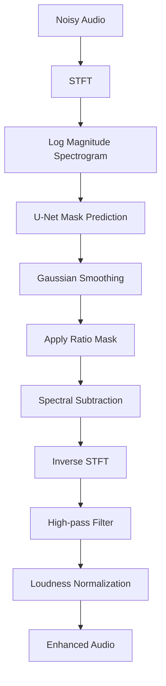

# AI Voice Enhancer

A deep learning based speech enhancement system that removes background noise from single-channel audio recordings using a U-Net based time-frequency masking approach.

The model predicts an Ideal Ratio Mask (IRM) on the magnitude spectrogram of noisy speech and reconstructs cleaner audio using inverse STFT. To further suppress residual noise, the enhanced signal undergoes Gaussian mask smoothing, spectral subtraction, high-pass filtering, and loudness normalization.

The project is trained on the VoiceBank-DEMAND dataset and includes a Streamlit web application for interactive speech enhancement.

---

## Features

- Deep learning based speech enhancement
- U-Net encoder-decoder architecture
- Ideal Ratio Mask (IRM) prediction
- STFT based feature extraction
- Gaussian mask smoothing
- Spectral subtraction
- High-pass filtering
- Loudness normalization
- Streamlit web interface
- Training and evaluation scripts

---

## Model Pipeline


---

## Project Structure

```text
AI-Voice-Enhancer/
│
├── notebooks/
│   └── audio_enhancement.ipynb
│
├── src/
│   ├── model.py
│   └── enhance.py
│
├── app.py
├── train.py
├── evaluate.py
├── requirements.txt
├── README.md
```

---

## Dataset

This project uses the **VoiceBank-DEMAND** dataset.

It contains paired noisy and clean speech recordings collected from:

- VoiceBank Corpus
- DEMAND Noise Database

Expected directory structure:

```text
data/

├── clean_trainset_28spk_wav/
├── noisy_trainset_28spk_wav/
├── clean_testset_wav/
└── noisy_testset_wav/
```

---

## Installation

```bash
git clone https://github.com/JoshitaaP/AI-Voice-Enhancer.git

cd AI-Voice-Enhancer

pip install -r requirements.txt
```

---

## Training

```bash
python train.py
```

---

## Evaluation

```bash
python evaluate.py
```

This generates:

- Enhanced audio
- SNR evaluation
- Spectrogram comparison

---

## Run the Web App

```bash
streamlit run app.py
```

Upload a noisy audio file and download the enhanced version.

---

## Results

Current implementation includes:

- Training and validation loss visualization
- Spectrogram comparison
- Signal-to-Noise Ratio (SNR) evaluation

---

## Future Work

- Improve PESQ and STOI scores
- Attention U-Net
- Real-time speech enhancement
- Transformer-based enhancement
- ONNX deployment
- Mobile deployment

---

## Author

**Joshitaa Padala**

B.Tech CSE (AI & ML)

VIT-AP University